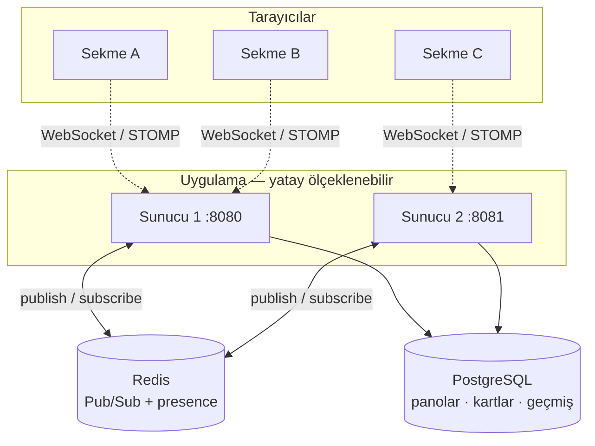
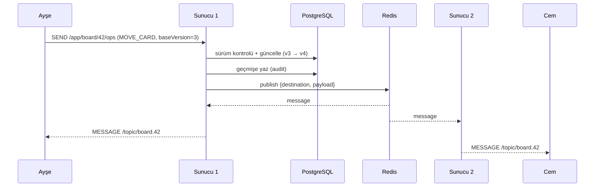
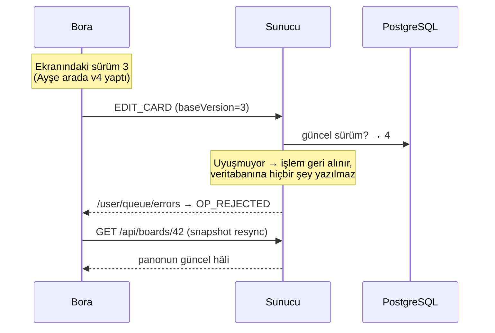

# CollabBoard — Gerçek Zamanlı İşbirlikçi Kanban Panosu

Birden çok kullanıcının **aynı anda** düzenlediği, her değişikliğin herkeste **anında** göründüğü bir Kanban panosu. Bir kişi kartı taşıdığında diğerlerinin ekranında da kayar — kimse sayfayı yenilemez.


---

## Neden ilginç?

Bu bir CRUD uygulaması değil. Gerçek zamanlı ve dağıtık sistemlerin üç zor sorusuna cevap veriyor:

| Soru | Cevap |
|------|-------|
| **Sunucu, istemciye polling olmadan nasıl haber verir?** | Sürekli açık WebSocket + STOMP pub/sub — [ADR 0002](docs/adr/0002-gercek-zamanli-protokol-stomp.md) |
| **İki kişi aynı kartı aynı anda değiştirirse ne olur?** | Optimistic sürüm kontrolü: bayat operasyon **reddedilir**, istemci kendini tazeler — [ADR 0003](docs/adr/0003-cakisma-cozumu-versiyon-kontrolu.md) |
| **Uygulamadan 2 kopya çalıştırınca canlı senkron neden bozulur?** | Abonelik defteri her sunucunun belleğindedir → **Redis Pub/Sub köprüsü** — [ADR 0004](docs/adr/0004-cok-sunucuya-olcekleme-redis-pubsub.md) |

Her önemli karar; alternatifleri, gerekçesi ve feda edilenlerle birlikte [`docs/adr/`](docs/adr/) altında yazılı.

---

## Özellikler

- **Canlı senkron** — kart ekleme / düzenleme / silme / sürükleyip taşıma ve kolon sıralama, tüm istemcilerde anında.
- **Çakışma koruması** — eşzamanlı düzenlemede sessiz veri kaybı yok. Reddedilen operasyon yalnızca gönderene bildirilir; istemci tam state ile kendini düzeltir.
- **Presence** — panoda kimlerin çevrimiçi olduğu, gerçek isim ve baş harflerle. Sekme kapanınca anında düşer (polling yok).
- **Yatay ölçekleme** — birden çok uygulama kopyası, Redis üzerinden tek bir canlı yayın gibi davranır.
- **Kimlik doğrulama** — JWT. WebSocket tarafında token, STOMP `CONNECT` frame'inde taşınır — [ADR 0005](docs/adr/0005-websocket-kimlik-dogrulama.md).
- **Pano geçmişi (audit)** — kim, ne zaman, ne yaptı. Reddedilen operasyon geçmişe yazılmaz.
- **Metrikler** — açık bağlantı sayısı, uygulanan ve reddedilen operasyonlar; arayüzde canlı gösterge şeridi.

---

## Demo

<!-- GIF kaydedip docs/demo.gif olarak koyduktan sonra bu satırın yorumunu kaldır:

-->

**Kendin dene:** İki tarayıcı sekmesinde **aynı** pano URL'sini aç (`http://localhost:8080/?board=1`), farklı kullanıcılarla giriş yap, bir sekmede kartı sürükle — diğerinde de kayar.

Ekranda ne var: sağ üstte **kimlerin çevrimiçi olduğu**, sağda **kimin ne yaptığı** (geçmiş paneli), sol altta **sistemin nabzı** (açık bağlantı · işlenen operasyon · çakışma reddi).

**Ölçeklemeyi görmek için** aşağıdaki "iki sunucu" adımlarını uygula ve sekmeleri farklı portlara bağla (`:8080` ve `:8081`) — senkron yine çalışır.

---

## Mimari



**İki kanal:** Panoya yeni giren istemci önce REST ile **tam fotoğrafı** alır (`GET /api/boards/{id}`), sonra WebSocket ile **o andan sonraki** değişiklikleri dinler. Maça geç kalınca önce skoru öğrenip sonra canlı izlemek gibi.

### Bir operasyonun yolculuğu



Yayınlayan sunucu **yerel gönderim yapmaz**: Redis mesajı kendi abonesine de dağıttığı için her olay her istemciye tam bir kez ulaşır.

### Çakışma: bayat operasyon nasıl reddedilir



Reddetme bildirimi **sadece gönderene** gider; diğer kullanıcılar bu gürültüyü görmez.

---

## Nasıl çalıştırılır

**Gerekenler:** Java 21, Docker.

```bash
# 1) Veritabanı ve Redis
docker compose up -d postgres redis

# 2) Uygulama (Flyway şemayı kendisi kurar)
./mvnw spring-boot:run
```

Tarayıcıda `http://localhost:8080` → kayıt ol → pano otomatik oluşur.

> Ayrı bir `.env` gerekmez: `application.yml` ile `docker-compose.yml` aynı varsayılanları kullanır (DB `collabboard`, kullanıcı `postgres`). **Üretimde** `JWT_SECRET` ve veritabanı şifresi mutlaka override edilmelidir.

### Testler

```bash
./mvnw test
```

Ön koşul yok — **Testcontainers** testler için kendi Postgres ve Redis'ini Docker'da başlatır (elle `docker compose up` gerekmez). Sahte (mock) bileşen kullanılmaz: Flyway migration'ları, JPA eşlemeleri ve gerçek STOMP trafiği çalışır. Kapsanan senaryolar:

- REST: kimliksiz erişimin reddi, pano oluşturma (3 varsayılan kolon), tam state, 404, doğrulama hatası
- **Canlı senkron:** bir istemcinin eklediği kart aynı panodaki herkese ulaşır
- **Sürüm artışı:** kart taşınınca yayınlanan olay güncel sürümü taşır
- **Çakışma:** bayat sürümle gelen operasyon reddedilir, reddetme yalnızca gönderene gider, ilk değişiklik korunur
- **Presence:** katılan kullanıcılar gerçek isimleriyle listelenir
- **Güvenlik:** geçersiz token ile WebSocket bağlantısı kurulamaz

### İki sunucuyla ölçeklemeyi görmek

```bash
# 1. kopya :8080'de çalışırken, 2. kopyayı başka porttan başlat:
./mvnw spring-boot:run -Dspring-boot.run.arguments=--server.port=8081
```

Bir sekmeyi `:8080`, diğerini `:8081` üzerinden **aynı** panoya bağla — canlı senkron sunucular arasında da çalışır. Redis'i durdurup denersen bozulduğunu, tekrar başlatınca düzeldiğini görebilirsin.

---

## API

### REST — "tam fotoğraf" kanalı

| Uç | Açıklama |
|----|----------|
| `POST /api/auth/register` · `POST /api/auth/login` | Kayıt / giriş (JWT) |
| `POST /api/boards` | Pano oluştur (To Do · In Progress · Done kolonlarıyla) |
| `GET /api/boards/{id}` | Panonun tam hâli (kolonlar + kartlar) |
| `GET /api/boards/{id}/activity?limit=20` | Pano geçmişi |

### WebSocket / STOMP — canlı kanal

| Adres | Yön | Açıklama |
|-------|-----|----------|
| `/ws` | — | El sıkışma; kimlik `CONNECT` frame'indeki `Authorization` başlığında |
| `/app/board/{id}/ops` | istemci → sunucu | Operasyon gönder |
| `/app/board/{id}/presence/join` | istemci → sunucu | Panoya katıl |
| `/topic/board.{id}` | sunucu → istemciler | Pano olayları |
| `/topic/board.{id}/presence` | sunucu → istemciler | Çevrimiçi listesi |
| `/user/queue/errors` | sunucu → **tek istemci** | Reddedilen operasyon bildirimi |

**Operasyonlar**, `type` alanına göre ayrışan tek bir mesaj tipidir (`sealed interface` + Jackson polimorfizmi):

```json
{ "type": "ADD_CARD",    "columnId": 1, "title": "Süt al" }
{ "type": "MOVE_CARD",   "cardId": 7, "toColumnId": 3, "position": 0, "baseVersion": 4 }
{ "type": "EDIT_CARD",   "cardId": 7, "title": "2L süt", "baseVersion": 4 }
{ "type": "DELETE_CARD", "cardId": 7 }
{ "type": "MOVE_COLUMN", "columnId": 1, "position": 2 }
```

Operasyon kümesi `sealed` olduğu için, yeni bir tip eklendiğinde onu işleyen `switch` güncellenmezse **kod derlenmez** — kapsam büyüdükçe güvenlik ağı derleyicidedir.

### Metrikler

```
GET /actuator/metrics/collabboard.ws.connections
GET /actuator/metrics/collabboard.operations?tag=type:MOVE_CARD
GET /actuator/metrics/collabboard.operations.rejected
```

Arayüzün sol alt köşesindeki şerit bunları canlı gösterir. `operations.rejected`, çakışma korumasının ne kadar iş yaptığının ölçüsüdür.

---

## Mimari kararlar (ADR)

| No | Karar |
|----|-------|
| [0001](docs/adr/0001-operasyon-tabanli-model-ve-cakisma-cozumu.md) | Operasyon tabanlı model + versiyonlama/LWW (OT/CRDT **değil**) |
| [0002](docs/adr/0002-gercek-zamanli-protokol-stomp.md) | STOMP over WebSocket (ham WebSocket / SSE değil) |
| [0003](docs/adr/0003-cakisma-cozumu-versiyon-kontrolu.md) | Optimistic sürüm kontrolü + snapshot resync |
| [0004](docs/adr/0004-cok-sunucuya-olcekleme-redis-pubsub.md) | Redis Pub/Sub köprüsü (sticky session / RabbitMQ değil) |
| [0005](docs/adr/0005-websocket-kimlik-dogrulama.md) | JWT, STOMP `CONNECT` frame'inde (URL'de değil) |

---

## Proje yapısı

Özelliğe göre paketleme (package-by-feature):

```
com.collabboard
├── board/          Kanban domaini: entity, REST, operasyonlar, STOMP controller
│   └── operation/  sealed BoardOperation + olay (event) tipleri
├── realtime/       Redis Pub/Sub köprüsü (BroadcastService + subscriber)
├── presence/       Kim çevrimiçi (Redis hash + WebSocket oturum olayları)
├── audit/          Pano geçmişi
├── observability/  Micrometer metrikleri
├── auth/ user/ security/   JWT kimlik doğrulama (WebSocket interceptor dahil)
├── common/         Ortak hata yönetimi, audit taban sınıfı
└── config/         WebSocket, Redis Pub/Sub, Jackson, OpenAPI
```

Frontend tek dosyada: [`src/main/resources/static/index.html`](src/main/resources/static/index.html) — vanilya JS, STOMP istemcisi ve SortableJS. Odak backend olduğu için framework kullanılmadı; amaç senkronu gözle görülebilir kılmak.

---

## Bilinen sınırlamalar

Bilinçli olarak kapsam dışında bırakıldı; her biri ilgili ADR'de gerekçesiyle yazılı:

- **Pano yetkilendirmesi yok** — giriş yapan her kullanıcı her panoya erişebilir (pano üyeliği/rolleri yok).
- **Token süresi** — access token'ın süresi dolduğunda açık WebSocket bağlantısı kendiliğinden düşmez; kimlik `CONNECT` anında doğrulanır.
- **Sunucu çökerse presence artığı** — Redis'teki çevrimiçi kaydı kalabilir. Gerçek sistemler bunu TTL + heartbeat ile çözer.
- **Pozisyon reindex'i** — taşımada kardeş kartların sıra numaraları yeniden düzenlenmiyor.
- **False conflict** — farklı alanlara dokunan eşzamanlı işlemler de reddedilebilir; alan bazlı sürümleme karmaşıklığı bilinçli olarak alınmadı.
- **Redis kritik bağımlılık** — çökerse canlı senkron durur; veri kaybolmaz, REST ve veritabanı çalışmaya devam eder.

**Sonraki adımlar:** pano üyeliği ve yetkilendirme, imleç paylaşımı, Prometheus + Grafana panosu, üretim ölçeği için harici STOMP broker (RabbitMQ) değerlendirmesi.
