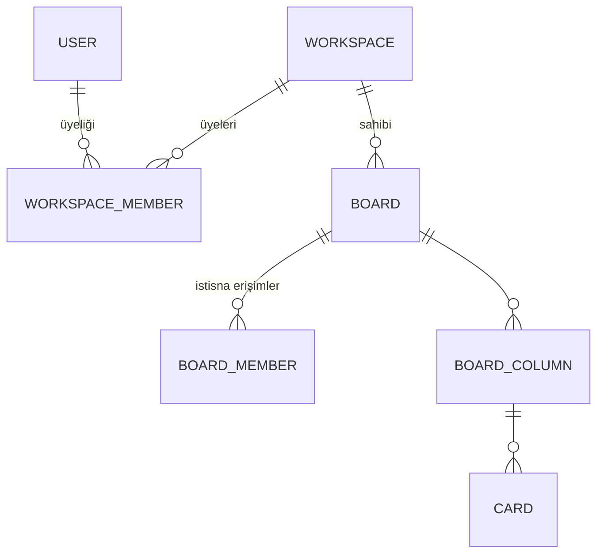

# Workspace (Şirket / Çalışma Alanı) — Uygulama Planı

> **Hedef:** Trello'daki gibi bir üst katman: panolar artık tek tek kullanıcılara değil, bir **çalışma alanına (workspace)** ait olur. Şirkete katılan biri, tek tek davet edilmeden şirketin panolarına erişir.

**Durum:** Planlandı · **Ön koşul:** Pano yetkilendirmesi (tamamlandı, commit `51ae05f`)

---

## Neden gerekli?

Şu an her pano bağımsız bir ada: 20 kişilik bir ekipte yeni bir panoya herkesi **tek tek** davet etmen gerekir; işten ayrılan birini **her panodan ayrı ayrı** çıkarman gerekir. Şirket katmanı bu iki sorunu da çözer:

```
ŞİMDİ                             SONRA
kullanıcı ──davet──> pano         kullanıcı ──üye──> ŞİRKET ──sahip──> panolar
kullanıcı ──davet──> pano                              (bir kez davet, hepsine erişim)
kullanıcı ──davet──> pano
```

---

## Veri modeli



**Kilit fikir:** `board_members` **silinmiyor**. Rolü değişiyor: artık "ana erişim yolu" değil, **istisna** — şirket üyesi olmayan bir misafiri tek bir panoya davet etmek ya da bir şirket üyesine tek panoda farklı bir rol vermek için.

---

## Roller

### Şirket rolleri (yeni)

| Rol | Şirketin panolarına | Üye yönetimi | Pano oluşturma |
|-----|:---:|:---:|:---:|
| `OWNER` | tam yetki | ✅ | ✅ |
| `ADMIN` | tam yetki | ✅ | ✅ |
| `MEMBER` | düzenleyebilir | — | ✅ |
| `GUEST` | **yok** (yalnızca ayrıca davet edildiği panolar) | — | — |

### Pano rolleri (mevcut, korunuyor)
`OWNER` / `EDITOR` / `VIEWER` — artık şirket rolünün **üstüne yazan istisna** olarak çalışır.

### Etkin rol (effective role) nasıl hesaplanır?

Bu, planın kalbi. Tek bir yerde — `BoardAccessService.roleOf(boardId, user)` — çözülür:

```
1. Panoda kişiye özel bir kayıt var mı (board_members)?
      VAR  → o rol geçerli (istisna, şirket rolünü EZER)
2. Yoksa: kişi panonun şirketinin üyesi mi?
      OWNER/ADMIN → pano OWNER'ı gibi davran
      MEMBER      → pano EDITOR'ü gibi davran
      GUEST       → erişim yok
3. Hiçbiri değilse → 403
```

> **Neden çağrı noktaları değişmeyecek?** Yetkilendirmeyi baştan tek kapıdan (`requireMember` / `requireEditor` / `requireOwner`) geçirdik. Bu adımda yalnızca **kapının arkasındaki mantık** genişler; controller'lar, WebSocket interceptor'ı ve servisler aynı kalır. Yetkilendirmeyi bu yüzden böyle tasarlamıştık.

---

## Adım adım uygulama

### Adım 1 — Şema (V7) ve geçiş  ⭐ en kritik

```sql
CREATE TABLE workspaces (
    id BIGSERIAL PRIMARY KEY,
    name VARCHAR(200) NOT NULL,
    slug VARCHAR(80) NOT NULL UNIQUE,     -- URL'de kullanılabilir kısa ad
    created_at TIMESTAMP NOT NULL DEFAULT CURRENT_TIMESTAMP
);

CREATE TABLE workspace_members (
    id BIGSERIAL PRIMARY KEY,
    workspace_id BIGINT NOT NULL REFERENCES workspaces(id) ON DELETE CASCADE,
    user_id BIGINT NOT NULL REFERENCES users(id) ON DELETE CASCADE,
    role VARCHAR(20) NOT NULL,
    created_at TIMESTAMP NOT NULL DEFAULT CURRENT_TIMESTAMP,
    CONSTRAINT uq_workspace_members UNIQUE (workspace_id, user_id)
);

ALTER TABLE boards ADD COLUMN workspace_id BIGINT REFERENCES workspaces(id);
```

**Geçiş (migration'ın ikinci yarısı) — mevcut veriyi kaybetmeden:**
1. Her kullanıcı için bir **"Kişisel Alan"** workspace'i oluştur, kendisini `OWNER` yap.
2. Her panoyu, mevcut `OWNER`'ının kişisel alanına bağla.
3. `boards.workspace_id` sütununu `NOT NULL` yap.

> Sıralama önemli: önce doldur, sonra zorunlu kıl. Tersi migration'ı patlatır.

**Karar:** Her pano bir workspace'e ait **olmak zorunda**. "Sahipsiz pano" ikinci bir kod yolu demektir; kişisel kullanım da bir workspace'tir (Trello'daki "Kişisel Alan" gibi).

### Adım 2 — Domain ve yetki mantığı
- `workspace/` paketi: `Workspace`, `WorkspaceRole`, `WorkspaceMember` (+ repository'ler)
- `WorkspaceAccessService`: `requireWorkspaceMember` / `requireWorkspaceAdmin`
- **`BoardAccessService.roleOf(...)` yukarıdaki 3 adımlı mantıkla genişletilir** ← asıl değişiklik burada
- `BoardService.createBoard(name, workspaceId, actor)`: kullanıcı o şirkette pano açabiliyor mu kontrol edilir

### Adım 3 — REST uçları
| Uç | Açıklama |
|----|----------|
| `GET /api/workspaces` | Üyesi olduğum şirketler (rolümle) |
| `POST /api/workspaces` | Şirket kur (kuran `OWNER`) |
| `GET /api/workspaces/{id}/boards` | Şirketin panoları |
| `GET/POST/DELETE /api/workspaces/{id}/members` | Şirket üyeliği (yalnızca `OWNER`/`ADMIN`) |
| `POST /api/boards` | Gövdeye `workspaceId` eklenir |

`GET /api/boards` ("panolarım") artık **iki kaynağın birleşimi**: şirket üyeliğimden gelen panolar + pano bazlı istisna erişimlerim.

### Adım 4 — Frontend
- Üstte **şirket seçici** (birden çok şirkete üye olunabilir)
- Pano seçim ekranı şirkete göre gruplanır
- **İki seviyeli üye yönetimi:** şirket üyeleri (kalıcı ekip) + pano misafirleri (istisna)
- Şirket kurma akışı

### Adım 5 — Davet akışı (opsiyonel iyileştirme)
Şu an davet ettiğin kişinin **zaten kayıtlı olması** gerekiyor. Gerçek ürün davranışı: e-posta ile **davet bağlantısı** (tek kullanımlık token), kişi kayıt olurken davet otomatik kabul edilir. Ayrı bir `invitations` tablosu ister; sisteme e-posta gönderimi ekler (kapsamı büyütür — sonraya bırakılabilir).

### Adım 6 — Testler ve ADR 0006
- Şirket üyesi, **ayrıca davet edilmeden** şirketin panosunu görebilir
- `GUEST` şirketin panolarını göremez, yalnızca davet edildiğini görür
- Pano bazlı istisna, şirket rolünü **ezer** (şirket `MEMBER`'ı bir panoda `VIEWER` yapılabilir)
- Şirketten çıkarılan kişi, şirketin **tüm** panolarına erişimini kaybeder ← özelliğin asıl vaadi
- **ADR 0006:** "Panolar neden şirkete ait? Etkin rol nasıl hesaplanır? Pano istisnası neden şirket rolünü ezer?"

---

## Dikkat edilecekler (gotcha'lar)

- **Yetki sorgusu her operasyonda çalışır.** Zincir uzadıkça (pano → şirket) sorgu sayısı artar; gerekirse etkin rolü kısa süreli **Redis cache**'ine almak gerekir (üyelik değişince temizlenmeli).
- **Topic adresleri değişmez** (`/topic/board.{id}`) → gerçek zamanlı katman ve Redis köprüsü bu işten hiç etkilenmez. İyi haber.
- **Audit'e `workspace_id` eklemek** ileride şirket bazlı raporlamayı mümkün kılar; şimdiden düşünmekte fayda var.
- **Şirket silinince ne olur?** Panolar da silinsin mi, arşive mi düşsün? Karar ADR 0006'ya yazılmalı (öneri: yumuşak silme/arşiv, çünkü veri kaybı geri alınamaz).
- **Son `OWNER` koruması** şirket seviyesinde de gerekli — panoda uyguladığımız kuralın aynısı.

---

## Sıralama ve emek tahmini

| Adım | Emek | Not |
|------|------|-----|
| 1 — Şema + geçiş | Orta | En riskli kısım; veri taşıma dikkat ister |
| 2 — Domain + etkin rol | Orta | Projenin yeni "kalbi" |
| 3 — REST | Küçük | Kalıp mevcut uçlarla aynı |
| 4 — Frontend | Orta | İki seviyeli üyelik arayüzü |
| 5 — Davet bağlantısı | Orta | **Opsiyonel**, sonraya bırakılabilir |
| 6 — Test + ADR | Küçük | Altyapı hazır |

**Önerilen sıra:** 1 → 2 → 6 (testler erken) → 3 → 4 → (5 opsiyonel)

Testleri 3-4'ten önce yazmak, yetki mantığındaki hatayı arayüz üzerinden değil doğrudan yakalamayı sağlar.
